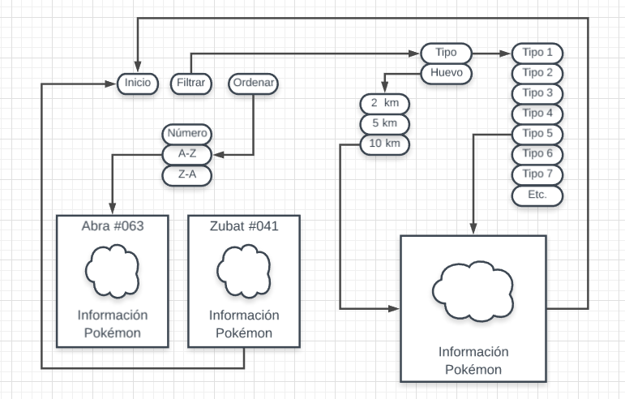
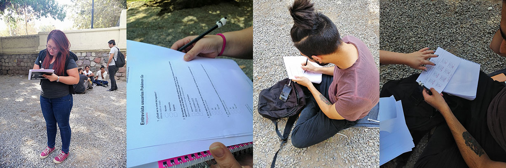
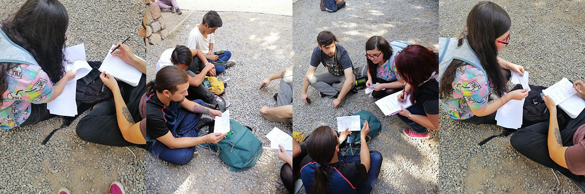

# DATADEX

**Pokémon GO** es un videojuego de realidad aumentada basado en la localización desarrollado por Niantic, Inc.1​2​ para dispositivos iOS y Android. Es un videojuego gratuito, pero contiene microtransacciones. ​ El juego consiste en buscar y capturar personajes de la saga Pokémon escondidos en ubicaciones del mundo real y luchar con ellos, lo que implica desplazarse físicamente por las calles de la ciudad para progresar. La aplicación comporta un elemento de interacción social, ya que promueve reuniones físicas de los usuarios en distintas ubicaciones de sus poblaciones.

**DataDex** es una aplicación web que busca apoyar con información a los jugadores de nivel bajo e intermedio en su camino por convertirse en jugadores avanzados en Pokémon Go.
    
• Para conocer más info sobre el juego [clic aquí](https://es.wikipedia.org/wiki/Pok%C3%A9mon_GO)
    
• Para conocer más info sobre Niantic, Inc [clic aquí](https://es.wikipedia.org/wiki/Niantic,_Inc.)
    
• Para descargar el juego o ver sus actualizaciones [clic aquí](https://pokemongolive.com/es/)
   
 • Para acceder a DataDex clic aquí (link githubpages)

# Definición del usuario
Comenzamos enfocando nuestra aplicación a todos los jugadores de Pokémon Go. Mediante la realización de los tests de usuario fuimos infiriendo que los jugadores avanzados o con más conocimientos y experiencia no necesitaban de los datos que podíamos entregar con nuestra aplicación, por lo que definimos que el usuario final serían jugadores de Pokémon Go de nivel bajo e intermedio que necesitaran conocer información valiosa y precisa de los Pokémon de la región de Kanto, los tipos elementales o los tipos de huevos por kilómetro.

# Historias de usuario

1. “Yo, como jugador de nivel bajo o intermedio de Pokémon Go…”
Quiero poder filtrar los Pokémon por tipo para conocer todos los Pokémon de mi tipo favorito.

### Criterios de aceptación

La aplicación debe dar al usuario la opción de elegir un tipo elemental y ver todos los Pokémon de ese tipo.

Para esta tarea se determinó usar un menú desplegable en la pantalla inicial con una lista de todos los tipos, donde el usuario podrá hacer clic en uno y la información se filtrará. 

2. “Yo, como jugador de nivel bajo o intermedio de Pokémon Go…”
Quiero poder filtrar los Pokémon por tipo de huevo (2 km, 5 km, 10 km), para saber cuál debería priorizar al momento de tener incubadoras disponibles para eclosionar.

### Criterios de aceptación
Para que el usuario pueda saber cuáles Pokémon eclosionan de un tipo de huevo en particular, se añadirá al menú desplegable la opción de filtrar por “Huevo”. 

Para esto separamos el menú desplegable en dos (ordenar y filtrar), si el usuario quiere filtrar información podrá cliquear el menú y aparecerá la opción “Por huevo”, una vez cliqueada dicha opción aparecerá una lista con los tipos de huevo (2 km, 5 km o 10 km). Luego de escoger uno, la información en pantalla se filtrará y aparecerán sólo los Pokémon de esa especie de huevo. Además, se mostrará un texto informando al usuario la cantidad total de Pokémon que eclosionan de ese tipo.

3. “Yo, como jugador de nivel bajo o intermedio de Pokémon Go…”
Quiero poder ordenar los Pokémon por nombre de manera ascendiente y descendiente, para poder llegar rápido al que quiero conocer mejor.

### Criterios de aceptación
Para esto incorporamos un menú desplegable en el inicio que será de fácil acceso. En este menú, le daremos al usuario 4 opciones de orden. Al oprimir la opción elegida los Pokémon en pantalla se reordenarán. Las opciones a escoger son:

• Por número, que es la forma por defecto en que se muestran.

• Por número descendiente en caso de que el usuario necesite llegar al último en la lista.

• Por orden alfabético de la A-Z, que le permitirá al usuario buscar un nombre en específico de manera más fácil.

• Por orden alfabético de la Z-A, que le permitirá al usuario buscar un nombre en específico de manera más fácil si el Pokémon comienza con Z, como “Zapdos” por ejemplo.

4. “Yo, como jugador de nivel bajo o intermedio de Pokémon Go…”
Quiero poder saber cuántos son los Pokémon que estoy filtrando por tipo y huevo para no tener que contarlos.

### Criterios de aceptación
Para resolver este problema determinamos mostrar desde el inicio el total de Pokémon que se están mostrando. Si el usuario filtra, el texto donde se muestra el total se actualizará.

Planificación del proyecto Data-Lovers
Ya que el proyecto está creado para ser trabajado en duplas, nuestros horarios debían estar muy bien organizados para funcionar bien, por lo que decidimos usar la herramienta “_Trello_”. Esta aplicación nos permitió estructurar el desarrollo del proyecto de forma digital, lo cuál nos acomodó al trabajar cada una desde su computador. Para acceder a nuestro “Trello” [clic aquí](https://trello.com/b/RKcSSOoW/data-lovers-pokemon)

# Definición del diseño de la interfaz

Para definir el diseño de la interfaz nos preocupamos de enfocarlo a los usuarios que juegan Pokémon Go. Al ser el juego una aplicación para celulares, partimos considerando cómo debería verse desde un dispositivo móvil y luego la versión de “escritorio” en caso de que fuera utilizada en una pantalla más grande. Tener en cuenta ambos tamaños nos permitió trabajar de mejor manera el diseño responsivo.

### Colores 
Principalmente los colores son los mismos que se utilizan dentro del juego Pokémon Go. Consideramos que sería más cómodo para el usuario el hecho de desenvolverse en un “ambiente conocido y familiar” 

### Tipografía 

La tipografía elegida es _Signika_, ya que es la utilizada en la página oficial de Pokémon y como mencionamos anteriormente, la idea es que el usuario, al acceder a la página, sepa de manera inmediata que se trata de una aplicación asociada al juego.

## Diagrama de flujo

El primer paso fue diseñar un diagrama de flujo para estructurar cómo sería el movimiento del usuario dentro de la aplicación.

     
## Prototipo de baja fidelidad

Nuestro siguiente paso fue crear este sketch, aqui comenzamos ideando como debería verse la aplicación y que elementos debía contener. Con nuestro prototipado listo testeamos con diversos usuarios con el objetivo de sacar distintas conclusiones para implementar en nuestro proyecto. 

## Test de usuario

 Con nuestro prototipo de baja fidelidad nos dirigimos al Parque Forestal con la finalidad de testear con usuarios reales de Pokémon Go y obtener respuestas inmediatas.

Gracias a esto logramos definir a nuestro usuario final, además de recibir feedback sobre nuestra interfaz.

## Protitipo de alta fidelidad 

Luego de nuestro testeo desarrollamos este diseño de Interfaz de usuario con algunos cambios con respecto a nuestro primer prototipo, principalmente en colores y tipo de menú, aquí definimos más claramente cómo queríamos que fuera nuestro resultado final. Para diseñar nuestro prototipado utilizamos la herramienta Figma, la cuál nos permitió trabajar de manera colaborativa. Esto nos permitió crear la versión escritorio y móvil.

## Figma

[Versión-escritorio](https://www.figma.com/file/F29Zm5LqlfCgfDDGgJy4Gr4z/POKEDEX?node-id=0%3A1)

[Versión-móvil](zpl.io/a31LWeN)

## Zeplin

[Versión-escritorio](zpl.io/awJ8kBK)

[Versión-móvil](https://www.figma.com/file/fWCrFT1j13OmD2tHWROboOE5/DataLovers?node-id=0%3A1)

*Nota: Allison, recuerda nuestro problema con los componentes en Zeplin por favor. Gracias

## Conclusión 

Nuestra aplicación web cumple con las necesidades que identificamos en los usuarios a través de nuestros test. 

### Aspectos a mejorar

Sin embargo hay componentes que se espera mejorar en el futuro

- Botón "Ver más"
- Mostrar tipos elementales en español
- Implementar sub-menú al navbar

